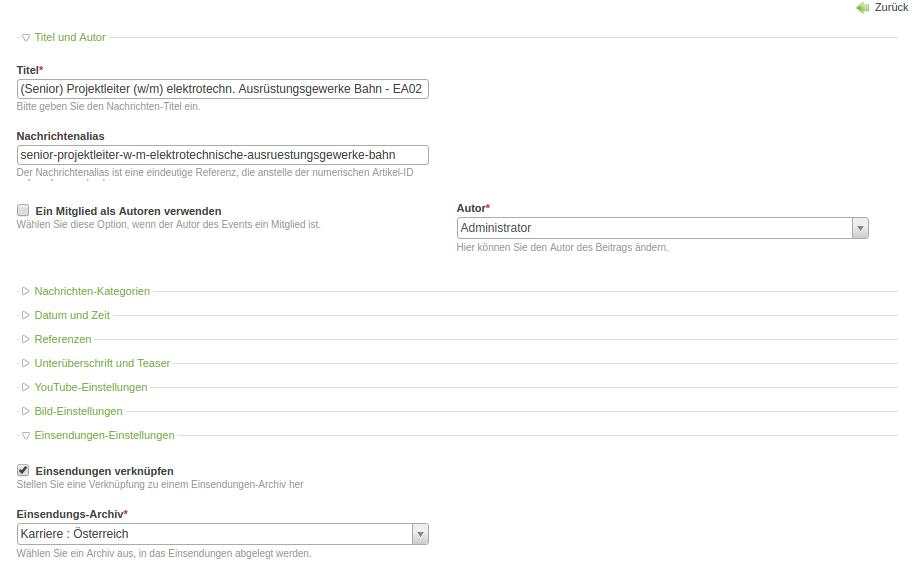

# Submissions Creator

Submission Creator makes usage from the power of [contao-submissions](https://github.com/heimrichhannot/contao-submissions) and [contao-frontendedit](https://github.com/heimrichhannot/contao-frontendedit).
It provides a reader module, that can create custom frontend forms with possible relations to other contao entities like news.

*Module configuration example*

---

*Submission archive configuration example*

---

*Submission view example (every field of this form can be changed, of course)*

---

*News relation configuration example*

---

## Features

* submission form creation
* custom field, mandatory fields, custom default values
* store submissions in custom submission archives
* limit submit period for submissions (on relations and module)  
* connect submissions with other contao entities (builtin: news & events)
* async submission
* redirect after submission

## Submission relations

To provide custom submission relations with other contao entities, you have to add a custom config to `$GLOBALS['SUBMISSION_RELATIONS']`. 
The key should be named like the backend module, for example `news` or `calendar`;

Attribute | Example | Description 
---- | -------- | -----------
table | 'tl_news' | The related entity table name (required for invoking tl_submision_relation_spread fields to this datacontainer)
invokePalettes | array('default' => 'addImage') | Array containing the entity palette as key and the prefix invokation field as value (required for invoking tl_submision_relation_spread fields to this datacontainer)
moduleFields | 'news_archives' | Add these fields to tl_module submission_creator palette as additional relation fields. 
submissionField | 'news' | The tl_submission field, where the id of the related entity should be stored in.
options_callback | array('HeimrichHannot\Submissions\Creator\SubmissionCreator', 'getRelatedNews') | Provide a valid options_callback that returns the options for the submissionField.
find_entity_callback | array('HeimrichHannot\Submissions\Creator\SubmissionCreator', 'findRelatedNewsEntity') | A valid callback that returns the entity object model.
setDefaultFromRequest | true | Set the submissionField from $_GET request parameter. Set to false if you don`t want this behavior.
request_parameter | 'rel' | Provide a custom request parameter that will be taken for setting the default relation entity from request or leave empty, than the submissionField value will taken as Request parameter ($_GET).
insertTagLink | '{{news_submission_link::PAGE_ID::MODULE_ID::ENTITY_ID}}' | The inserttag that will be available to link to the submission from outside. PAGE_ID, MODULE_ID, ENTITY_ID must be definied as String like provided in the Example.
useAutoItem | true | Set the request parameter as auto_item and generate a readable alias and append to the submission page url.
entity_tokens | array('submission_form' => array('recipients' => array('news_*'),'email_subject' => array('news_*'),'email_text' => array('news_*'), | Add your custom submission notification entity tokens. 

### Callbacks

Name | Arguments | Expected return value | Description
---- | --------- | --------------------- | -----------
options_callback | \DataContainer $dc, $arrRelation | $arrOptions | Return the submissionField options as array for both front and back end.
find_entity_callback | $varId, $arrRelation, $objModule  | Return the entity Model or null if not found.
addTokens_callback |  $objItem, $arrTokens, $arrRelation, $objNotification, $strLanguage, $objGatewayModel / Add custom notification tokens. Callback have to return $arrTokens.

### InsertTags

Tag | Arguments | Example | Description 
--- | --------- | ------- | -------
news_submission_link | PAGE_ID :: MODULE_ID :: NEWS_ID | {{news_submission_link::55::77::308}} | Return the link to a related news submission
event_submission_link | PAGE_ID :: MODULE_ID :: EVENT_ID | {{event_submission_link::15::55::306}} | Return the link to a related event submission
news_submission_active | MODULE_ID :: NEWS_ID | {{news_submission_active::77::308}} | Determine that the related news submission is active, within submission period.
event_submission_active | MODULE_ID :: EVENT_ID | {{event_submission_active::55::306}} | Determine that the related event submission is active, within submission period.

